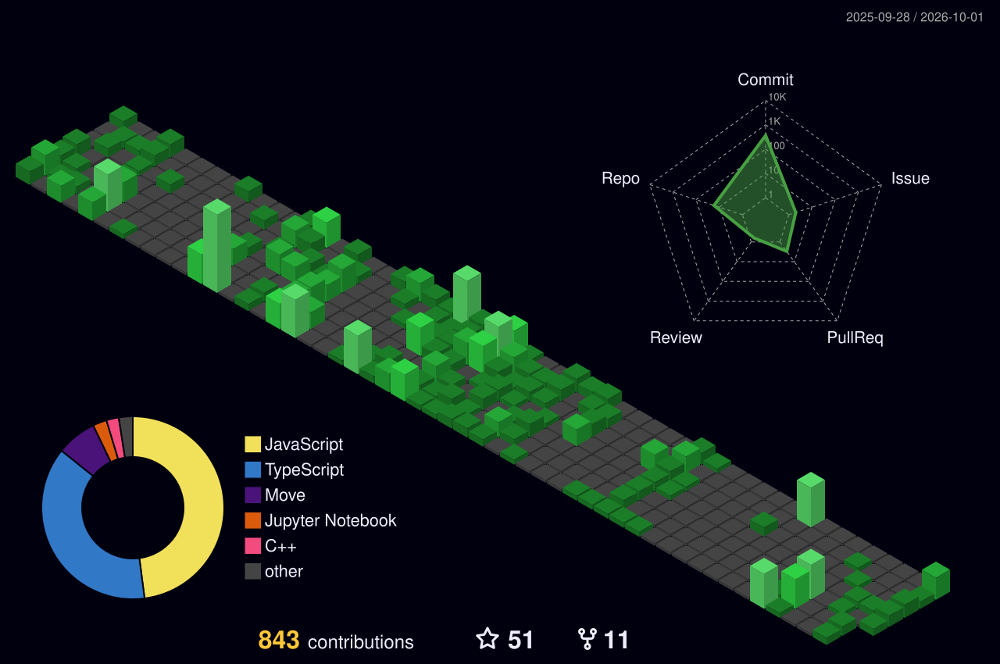

<!-- ========================= -->
<!--        HERO IMAGE         -->
<!-- ========================= -->

  

 

<!-- ========================= -->
<!--         HEADER            -->
<!-- ========================= -->

# 👋 Hey, I'm Subrata Mondal

### 💻 Full-Stack Developer • DSA Enthusiast • Competitive Programmer

  Building scalable web applications, solving challenging problems,
  and turning ideas into real-world products.

  
  

  
  
  

 

---

# 👨‍💻 About Me

I'm a **Computer Science & Engineering student at Netaji Subhash Engineering College, Kolkata**, passionate about **full-stack development, Data Structures & Algorithms, and problem solving**.

I enjoy building practical applications with modern web technologies and continuously improving my engineering skills through coding, hackathons, and collaborative learning.

- 🎓 B.Tech in Computer Science & Engineering
- 💻 Focused on **Full-Stack Web Development**
- 🧠 Strong foundation in **DSA & Algorithms**
- ⚡ Experienced with the **MERN ecosystem**
- 🚀 Interested in building scalable and user-focused products
- 🏆 Multiple hackathon winner / achiever
- 🔥 700+ LeetCode problems solved
- 📚 550+ GeeksforGeeks problems solved

---

# 🛠️ Technical Skills

### 💻 Languages

  
  
  
  
  

### 🎨 Frontend Development

  
  
  
  
  
  
  
  

### ⚙️ Backend Development

  
  
  

### 🗄️ Databases & Storage

  
  
  
  

### 🔧 Tools & Platforms

  
  
  
  
  
  
  

### 🧠 Core Competencies

`Data Structures & Algorithms` • `Problem Solving` • `Object-Oriented Design` • `Debugging` • `Complexity Analysis` • `Algorithms`

# 🏆 Achievements

- 🥇 **Winner — Exathon 2025**  
  Secured 1st rank among **100+ teams** as part of a 3-member team.

- 🥈 **2nd Runner-Up — Smart Make-a-thon**  
  Ranked among **200 teams** with a sustainable project.

- 🥇 **Winner — HackSpire'25 UI/UX**  
  Team **Code Kinetics** ranked 1st for *Kisan Mitra*.

- 🥉 **3rd Place + Aptos Track Winner — CosmoHack1**  
  Selected from **2500+ participants**.

- 🥇 **Winner — Binary 2.0 Hackathon**  
  Winner of the **Requestly Track** with *Second Brain*, an AI assistant for tasks.

- 🏆 **TCS CodeVita Season 12**  
  Ranked in the **Top 0.65%** with Global Rank **3172 / 400,000**.

- 🔥 **LeetCode**  
  Solved **700+ problems** with a **1518 rating** and a **260-day streak**.

- 📚 **GeeksforGeeks**  
  Solved **550+ problems**, achieved **Institute Rank 20**, with a **134-day streak**.

---

# 🧩 Coding Profiles

  

---

# 📊 GitHub Stats

 

---

# 📈 My GitHub History

<h2>
  
  &nbsp;Contribution History
</h2>

  

---

# 🐍 Contribution Snake

---

# ✍️ Random Dev Quote

---

## 🏆 Holopin Badges

### 🔝 Top Contributed Repo

  

### 🚀 Code • Build • Solve • Repeat

<i>Always learning. Always building. Always improving.</i>

