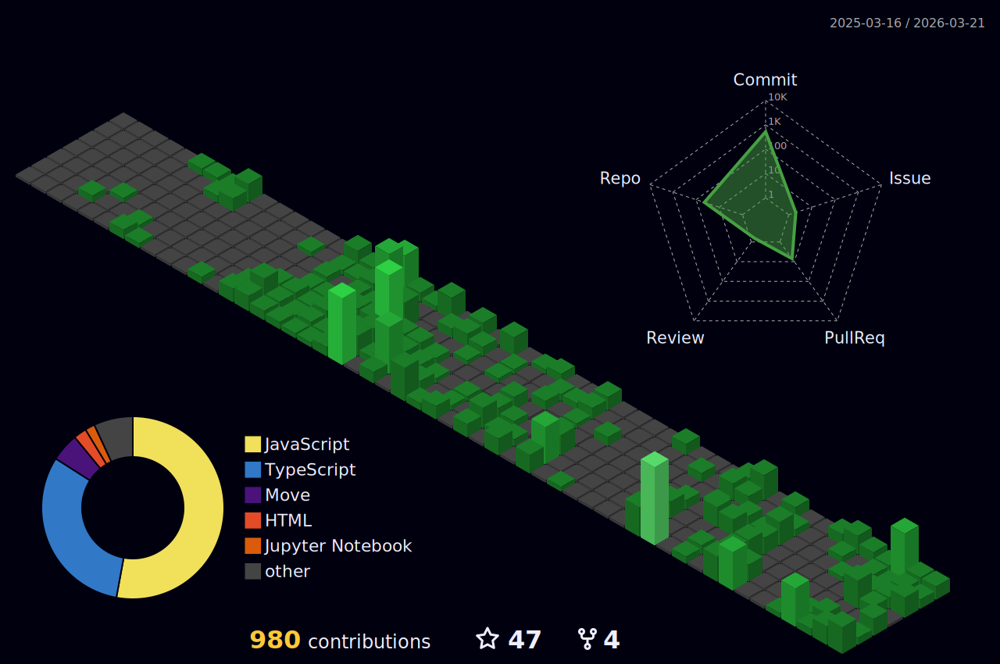

<h1 align="center">Hi 👋, I'm Subrata Mondal </h1>

# 💫 About Me:

<h3 align="center">A passionate developer and problem-solver from India</h3>
 

<table style="border-collapse: collapse; border: none;">
  <tr>
    <td width="55%" valign="top" style="border: none;">
      - 🔭 I’m currently pursuing <b>Bachelor of Engineering in Computer Science and Engineering</b>.  
      - 🌱 I’m learning <b>Data Structures & Algorithms</b> and building skills as a <b>Full-Stack / MERN Stack Developer</b>.  
      - 👯 I’m looking to collaborate on <b>innovative and exciting projects</b>.  
      - 💬 Ask me about <b>Web Development, DSA, and Tech in general</b>.  
      - 📫 Reach me at <b>subratamondal.cse2023@nsec.ac.in</b>.  
      - ⚡ Fun fact: <b>I love solving complex problems—whether debugging code or cracking challenging algorithms, finding the solution is my thrill!</b>
    </td>
    <td width="45%" valign="top" style="border: none;">
      
    </td>
  </tr>
</table>

## 🌐 Socials:

# 💻 Tech Stack:

### 💻 Languages

### 🌐 Frontend

### 🛠 Backend

### 🗃 Databases

### ⚙ Tools & Platforms

# 📊 GitHub Stats:
  
  

<h2>   &nbsp;My GitHub History! 📈</h2>

## 🏆 GitHub Trophies

<!-- ## 🏆 Holopin Badges

-->

## ✍️ Random Dev Quote

<!--### 🔝 Top Contributed Repo
 -->

  

